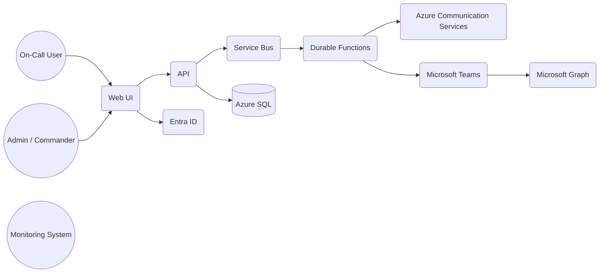

# System Context

The platform interacts with:

- Users: On-call engineers, dispatchers, responders
- External Systems: Monitoring tools posting incidents
- Microsoft Graph: Teams messages, Adaptive Cards
- ACS: SMS, email notifications
- Azure SQL: Persistence layer
